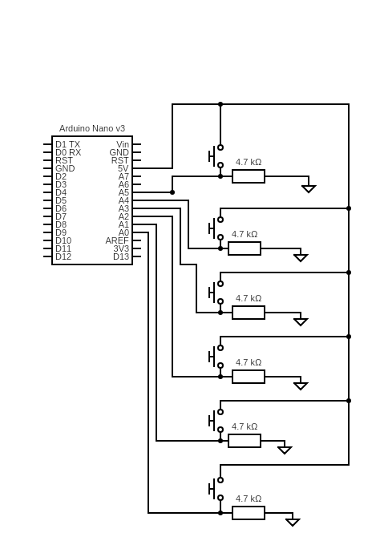
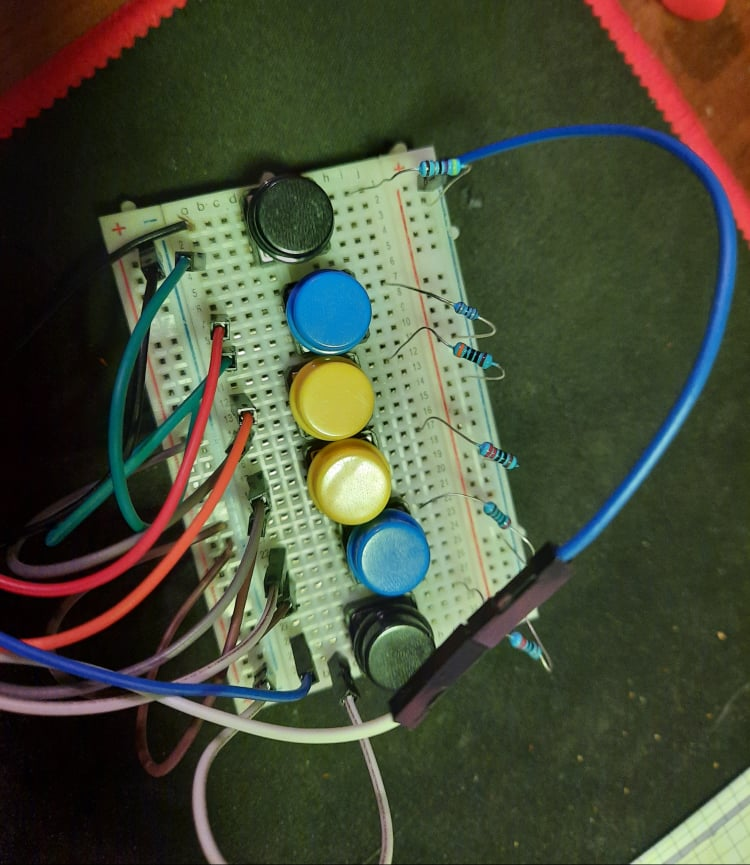
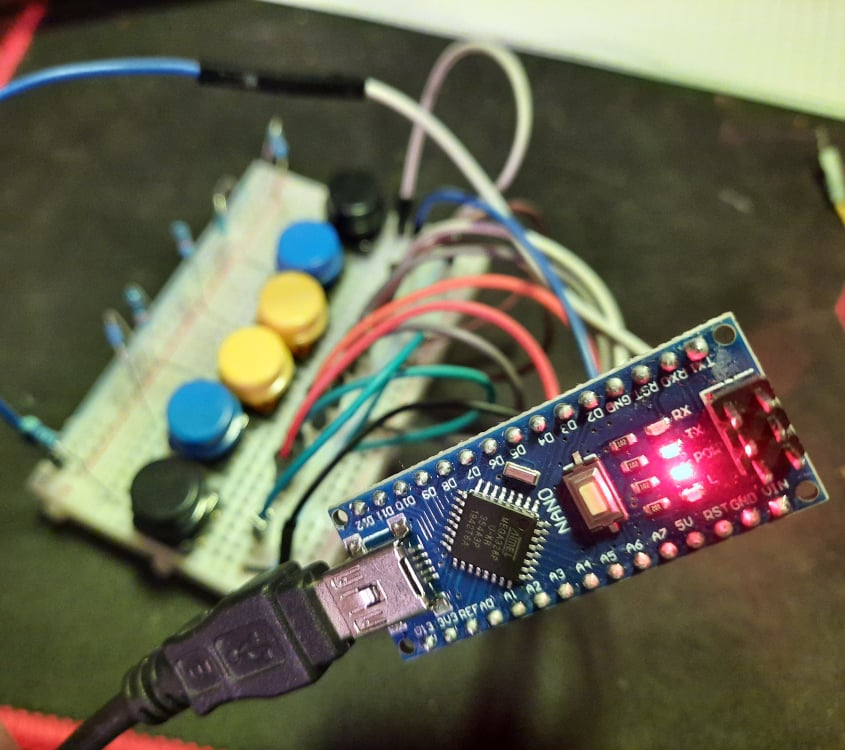

# arduino-nano-keyboard-workaround

So I tried to make MIDI Keyboard using my Arduino (Nano AtMega328p) from China but library doesn't work on it. 

So I wasted my time and made this, workaround using python to read serial and send keypresses (**one at time**) to pc, while arduino just sends Serial.println(wasteoftime), where
*wasteoftime=some letter, who cares* 

Arduino and python source files are in folder "wasteoftime". 

Is there any other way doing this? Absolutely yes 
Do I give a crap? Absolutely no 

Circuit:

Some pics:

